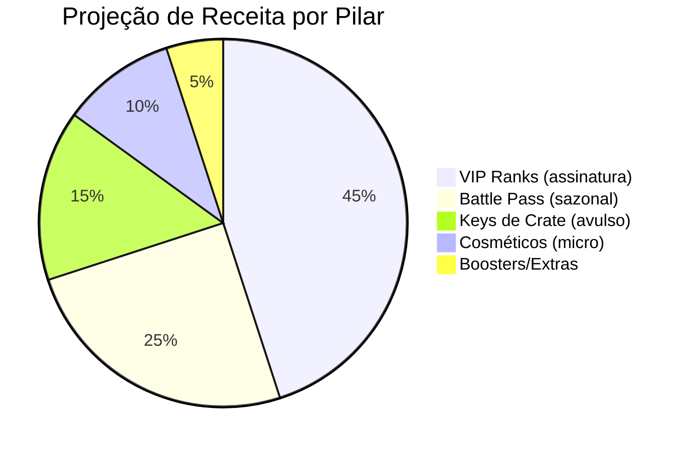

# 💰 GorvaxCore — Guia Completo de Monetização

> Documento estratégico de negócios para o servidor Gorvax.
> Filosofia: **Zero Pay-to-Win** | Público-alvo: **Mercado Brasileiro** | Moeda: **R$ (BRL)**

---

## 📊 Visão Geral dos Pilares de Receita



| Pilar | Tipo | Ticket Médio | Frequência | Potencial |
|-------|------|:------------:|:----------:|:---------:|
| 🏷 **VIP Ranks** | Recorrente / Vitalício | R$ 9,90–89,90 | Mensal | ⭐⭐⭐⭐⭐ |
| 🎫 **Battle Pass** | Sazonal | R$ 14,90–24,90 | A cada 30 dias | ⭐⭐⭐⭐ |
| 🎰 **Keys de Crate** | Compra avulsa | R$ 2,90–14,90 | Impulso | ⭐⭐⭐ |
| ✨ **Cosméticos** | Compra única | R$ 4,90–19,90 | Único | ⭐⭐ |
| ⚡ **Boosters** | Consumível | R$ 3,90–9,90 | Semanal | ⭐⭐ |

---

## 1. 🏷 VIP Ranks — Receita Principal

### Tabela de Preços

| Plano | ✦ VIP | ✦ VIP+ | ⚡ ELITE | 🐉 LENDÁRIO |
|-------|:-----:|:------:|:-------:|:-----------:|
| **Mensal** | R$ 9,90 | R$ 24,90 | R$ 49,90 | R$ 89,90 |
| **Trimestral** (-16%) | R$ 24,90 | R$ 59,90 | R$ 119,90 | R$ 219,90 |
| **Semestral** (-25%) | R$ 44,90 | R$ 109,90 | R$ 224,90 | R$ 399,90 |
| **Vitalício** (~5x) | R$ 49,90 | R$ 119,90 | R$ 249,90 | R$ 449,90 |

### Benefícios por Tier

| Benefício | VIP | VIP+ | ELITE | LENDÁRIO |
|-----------|:---:|:----:|:-----:|:--------:|
| Blocos extras | +500 | +1.500 | +3.000 | +5.000 |
| Homes extras | +2 | +5 | +10 | +15 |
| Keys Raro/mês | 1 | 2 | 3 | 3 |
| Keys Lendário/mês | — | 1 | 1 | 2 |
| Desconto mercado | 0% | 5% | 10% | 15% |
| Prefixo exclusivo | ✔ | ✔ | ✔ | ✔ |
| Cor de nick | — | ✔ | ✔ | ✔ |
| Trail de partículas | — | — | ✔ | ✔ |
| Kill effect exclusivo | — | — | — | ✔ |

### Projeção de Receita VIP

| Cenário | Jogadores Ativos | Conversão VIP | ARPU/mês | Receita Mensal |
|---------|:----------------:|:-------------:|:--------:|:--------------:|
| **Conservador** | 50 | 8% (4 VIPs) | R$ 25 | R$ 100 |
| **Moderado** | 150 | 12% (18 VIPs) | R$ 35 | R$ 630 |
| **Otimista** | 500 | 15% (75 VIPs) | R$ 40 | R$ 3.000 |

> **Benchmark BR:** Servidores survival de médio porte faturam R$ 500–3.000/mês apenas com VIP.

### Comandos Tebex (Ativação)

```
# Compra VIP Mensal (com expiração automática)
lp user {username} parent addtemp vip 30d

# Compra VIP Vitalício
lp user {username} parent set vip

# Upgrade (remove antigo, adiciona novo)
lp user {username} parent remove vip
lp user {username} parent set vip-plus

# Expiração/Cancelamento
lp user {username} parent set default
```

---

## 2. 🎫 Battle Pass — Receita Sazonal

> **Status:** ✅ Implementado — trilha Free + Premium com 30 níveis.

### Modelo

| Aspecto | Valor |
|---------|-------|
| **Duração da temporada** | 30 dias |
| **Níveis** | 30 (1 por dia) |
| **Track Gratuito** | Todos os jogadores |
| **Track Premium** | Compra única por temporada |
| **Preço Premium** | R$ 14,90 |
| **Preço Premium+** (pula 10 níveis) | R$ 24,90 |

### Recompensas por Track

| Nível | Track Gratuito | Track Premium |
|:-----:|----------------|---------------|
| 1–5 | $100–500, blocos | Keys raro, cosméticos exclusivos |
| 6–15 | Blocos, itens básicos | Títulos exclusivos, partículas |
| 16–25 | Keys comuns, $1.000 | Kill effects, trails de flecha |
| 26–29 | Blocos, títulos básicos | Keys lendários, tag exclusiva |
| **30** | 500 blocos + $2.000 | **Skin de cosmético sazonal** + 3 keys lendários |

### Projeção Battle Pass

| Cenário | Jogadores | Conversão | Receita/Temp. | Receita Anual (12 temp.) |
|---------|:---------:|:---------:|:-------------:|:------------------------:|
| **Conservador** | 50 | 15% (8) | R$ 119 | R$ 1.430 |
| **Moderado** | 150 | 20% (30) | R$ 447 | R$ 5.364 |
| **Otimista** | 500 | 25% (125) | R$ 1.862 | R$ 22.350 |

> **Vantagem estratégica:** Battle Pass incentiva login diário → retenção → mais chances de conversão VIP.

---

## 3. 🎰 Keys de Crate — Receita por Impulso

### Preços Avulsos

| Key | Preço Unitário | Pacote 3x (-15%) | Pacote 5x (-20%) | Pacote 10x (-30%) |
|-----|:--------------:|:-----------------:|:-----------------:|:------------------:|
| ⬜ **Comum** | R$ 1,90 | R$ 4,90 | R$ 7,90 | R$ 12,90 |
| 🔵 **Raro** | R$ 4,90 | R$ 12,90 | R$ 19,90 | R$ 34,90 |
| 🟡 **Lendário** | R$ 9,90 | R$ 24,90 | R$ 39,90 | R$ 69,90 |
| 🟣 **Sazonal** | R$ 14,90 | R$ 37,90 | R$ 59,90 | R$ 104,90 |

### Comandos Tebex

```
# Entrega de keys
crate give {username} comum {quantity}
crate give {username} raro {quantity}
crate give {username} lendario {quantity}
crate give {username} sazonal {quantity}
```

### Projeção Keys

| Cenário | Vendas/mês | Ticket Médio | Receita Mensal |
|---------|:----------:|:------------:|:--------------:|
| **Conservador** | 15 pacotes | R$ 12 | R$ 180 |
| **Moderado** | 50 pacotes | R$ 15 | R$ 750 |
| **Otimista** | 150 pacotes | R$ 18 | R$ 2.700 |

> ⚠️ **EULA:** Keys NÃO são lootboxes se o jogador pode ver as chances antes de comprar (já implementado com `/crate preview`).

---

## 4. ✨ Cosméticos — Micro-transações

### Catálogo de Cosméticos à Venda

| Cosmético | Tipo | Preço | Exclusividade |
|-----------|------|:-----:|:-------------:|
| 🔥 Rastro de Fogo | Walk Particle | Grátis (conquista) | — |
| ❄️ Rastro de Gelo | Walk Particle | R$ 4,90 | Loja |
| 💜 Trilha de Ender | Arrow Trail | R$ 6,90 | Loja |
| ⚡ Trilha Elétrica | Arrow Trail | R$ 6,90 | Loja |
| 🏷 Tag Guerreiro | Chat Tag | Grátis (conquista) | — |
| 🏷 Tag Caçador | Chat Tag | R$ 3,90 | Loja |
| 🏷 Tag Dragão | Chat Tag | R$ 7,90 | VIP+ only |
| ⚡ Kill: Relâmpago | Kill Effect | Grátis (conquista) | — |
| 🎆 Kill: Fogos | Kill Effect | R$ 9,90 | Loja |
| 💥 Kill: Explosão | Kill Effect | R$ 9,90 | Loja |
| 💀 Kill: Wither Storm | Kill Effect | R$ 14,90 | ELITE+ only |
| 🌈 Partícula Arco-Íris | Walk Particle | R$ 12,90 | LENDÁRIO only |

### Pacotes Temáticos

| Pacote | Conteúdo | Preço | Desconto vs. avulso |
|--------|----------|:-----:|:-------------------:|
| **Starter Pack** | 3 cosméticos básicos + 2 keys raro | R$ 14,90 | ~30% |
| **Guerreiro Pack** | Kill effects + trail + tag | R$ 24,90 | ~25% |
| **Ultimate Pack** | Todos os cosméticos de loja | R$ 49,90 | ~40% |

### Comandos Tebex

```
# Desbloquear cosmético específico
cosmetics give {username} rastro_gelo
cosmetics give {username} kill_fogos
cosmetics give {username} tag_dragao
```

---

## 5. ⚡ Boosters & Extras — Consumíveis

> Itens de consumo que não dão vantagem PvP. Futura implementação.

| Produto | Efeito | Duração | Preço |
|---------|--------|:-------:|:-----:|
| 💰 **Booster de $ (2x)** | Dobra ganhos de dinheiro (mobs, vendas NPC) | 1 hora | R$ 3,90 |
| ⭐ **Booster de XP (2x)** | Dobra XP de Minecraft | 1 hora | R$ 3,90 |
| 🏠 **Home Extra** | +1 home permanente | Permanente | R$ 4,90 |
| 🧱 **500 Blocos** | +500 blocos de proteção | Permanente | R$ 6,90 |
| 🧱 **2.000 Blocos** | +2.000 blocos de proteção | Permanente | R$ 19,90 |
| 🔄 **Nick Color** | Troca de cor do nick (chat) | Permanente | R$ 5,90 |

> **Nota:** Boosters de $ e XP afetam apenas mobs e atividades PvE, nunca PvP = EULA compliant.

---

## 📅 Calendário de Promoções

| Evento | Data | Desconto | Duração | Tipo |
|--------|------|:--------:|:-------:|------|
| 🚀 **Lançamento** | Abertura do servidor | 30% em tudo | 7 dias | Flash |
| 🎄 **Natal** | 20–26 Dez | 40% VIP + crate sazonal grátis | 7 dias | Sazonal |
| 🎆 **Ano Novo** | 30 Dez – 2 Jan | 25% em tudo | 4 dias | Sazonal |
| ❤️ **Dia dos Namorados** | 12 Jun | 20% em cosméticos | 3 dias | Temático |
| 🛒 **Black Friday** | Última sex de Nov | 50% VIP vitalício | 3 dias | Flash |
| 🎂 **Aniversário do Servidor** | Data do lançamento | 30% em tudo + key grátis | 5 dias | Especial |
| 📦 **Flash Sale** | Aleatório (1x/mês) | 25% em keys | 24 horas | Urgência |
| ⬆️ **Upgrade Week** | 1x a cada 2 meses | 50% diferença de upgrade | 5 dias | Retenção |

---

## 🏦 Resumo Financeiro — Projeções

### Cenário Conservador (50 jogadores ativos)

| Pilar | Receita Mensal | Receita Anual |
|-------|:--------------:|:-------------:|
| VIP Ranks | R$ 100 | R$ 1.200 |
| Battle Pass | R$ 119 | R$ 1.430 |
| Keys | R$ 180 | R$ 2.160 |
| Cosméticos | R$ 50 | R$ 600 |
| Boosters/Extras | R$ 30 | R$ 360 |
| **TOTAL** | **R$ 479** | **R$ 5.750** |

### Cenário Moderado (150 jogadores ativos)

| Pilar | Receita Mensal | Receita Anual |
|-------|:--------------:|:-------------:|
| VIP Ranks | R$ 630 | R$ 7.560 |
| Battle Pass | R$ 447 | R$ 5.364 |
| Keys | R$ 750 | R$ 9.000 |
| Cosméticos | R$ 200 | R$ 2.400 |
| Boosters/Extras | R$ 150 | R$ 1.800 |
| **TOTAL** | **R$ 2.177** | **R$ 26.124** |

### Cenário Otimista (500 jogadores ativos)

| Pilar | Receita Mensal | Receita Anual |
|-------|:--------------:|:-------------:|
| VIP Ranks | R$ 3.000 | R$ 36.000 |
| Battle Pass | R$ 1.862 | R$ 22.350 |
| Keys | R$ 2.700 | R$ 32.400 |
| Cosméticos | R$ 600 | R$ 7.200 |
| Boosters/Extras | R$ 400 | R$ 4.800 |
| **TOTAL** | **R$ 8.562** | **R$ 102.750** |

---

## 💳 Custos Operacionais

| Item | Custo Mensal | Notas |
|------|:------------:|-------|
| **Hosting (Dedicado)** | R$ 150–300 | Bare-metal BR (OVH, HostMídia, Contabo) |
| **Tebex** | 5% das vendas | Sem mensalidade no plano gratuito |
| **Domínio (.com.br)** | ~R$ 3/mês | Anual ~R$ 40 |
| **Discord Nitro (Boost)** | R$ 0 | Opcional, apenas se quiser perks no DC |
| **Marketing (ads)** | R$ 50–200 | YouTube BR, TikTok, Discord servers |
| **Total estimado** | **R$ 200–500** | Breakeven: ~20 VIPs mensais |

### Ponto de Equilíbrio (Breakeven)

```
Custos fixos ≈ R$ 300/mês
Ticket médio VIP = R$ 25 (after Tebex fees)
Breakeven = 300 ÷ 25 = 12 VIPs mensais
```

> Com apenas **12 assinantes VIP** o servidor se paga sozinho. 🎯

---

## 🛒 Setup da Loja (Tebex)

> **🌐 Loja Online:** [gorvaxmc.tebex.io](https://gorvaxmc.tebex.io)
> **📧 Suporte:** leogorska22@hotmail.com

### Passo a Passo

1. ~~Criar conta em [tebex.io](https://tebex.io)~~ ✅
2. Vincular servidor (`tebex secret <key>` no console)
3. ~~Criar categorias na loja:~~ ✅
   - 🏷 VIP Ranks (16 pacotes)
   - 🎰 Keys & Crates (13 pacotes)
   - ✨ Cosméticos (7 pacotes)
   - 📦 Pacotes Especiais (4 pacotes)
   - ⚡ Boosters (futuro)
4. ~~Cada produto configura um **comando de console** a executar~~ ✅
5. Ativar PIX como método de pagamento (BRL nativo)
6. ~~Customizar a loja com branding do Gorvax~~ ✅

### Métodos de Pagamento (BR)

| Método | Taxa | Conversão |
|--------|:----:|:---------:|
| **PIX** | ~2% | Instantâneo |
| **Cartão de Crédito** | ~5% | Imediato |
| **PayPal** | ~6% | Imediato |
| **Boleto** | ~3% | 1–3 dias úteis |

---

## 🎯 Estratégia de Crescimento

### Fase 1 — Lançamento (Mês 1–2)
- Promoção de 30% em todos os VIPs
- Keys gratuitas para primeiros 100 jogadores
- Divulgação em comunidades MC BR (Reddit, Discord, YouTube)
- Meta: **50 jogadores ativos**, **4 VIPs**

### Fase 2 — Consolidação (Mês 3–6)
- Lançar Battle Pass (B15)
- Eventos sazonais com crates exclusivos
- Parcerias com YouTubers MC BR (micro-influenciadores)
- Meta: **150 jogadores ativos**, **18 VIPs**

### Fase 3 — Escala (Mês 7–12)
- Cosméticos premium com drop limitado
- Programa de indicação (ganhe key ao indicar amigo)
- Torneios PvP com premiação (ingame)
- Meta: **300+ jogadores**, **40+ VIPs**

---

## ⚖️ Compliance — EULA Minecraft

> [!IMPORTANT]
> Todos os itens vendidos seguem as diretrizes da EULA da Mojang.

| Regra | Status |
|-------|:------:|
| Sem vantagem PvP direta | ✅ |
| Sem itens P2W (armas, armaduras pagas) | ✅ |
| Jogador pode ver chances das crates | ✅ (`/crate preview`) |
| Cosméticos não afetam gameplay | ✅ |
| Benefícios VIP são conveniência/cosmético | ✅ |
| Jogadores F2P podem progredir normalmente | ✅ |

---

## 📋 Checklist de Implementação

| Item | Status | Prioridade |
|------|:------:|:----------:|
| Sistema VIP (4 tiers) | ✅ Implementado | — |
| Sistema de Crates/Keys | ✅ Implementado | — |
| Sistema de Cosméticos | ✅ Implementado | — |
| Battle Pass | ✅ Implementado | — |
| Criar conta Tebex | ✅ Criada | — |
| Configurar produtos na loja | ✅ 40 pacotes | — |
| Personalizar webstore | ✅ Branding aplicado | — |
| Vincular servidor (tebex secret) | ⬜ Pendente | 🔴 Alta |
| Ativar PIX/Cartão (Wallet) | ⬜ Pendente | 🔴 Alta |
| Verificar identidade (ID) | ⬜ Pendente | 🔴 Alta |
| Boosters & Extras | ⬜ Futuro | 🟢 Baixa |
| Programa de indicação | ⬜ Futuro | 🟢 Baixa |
